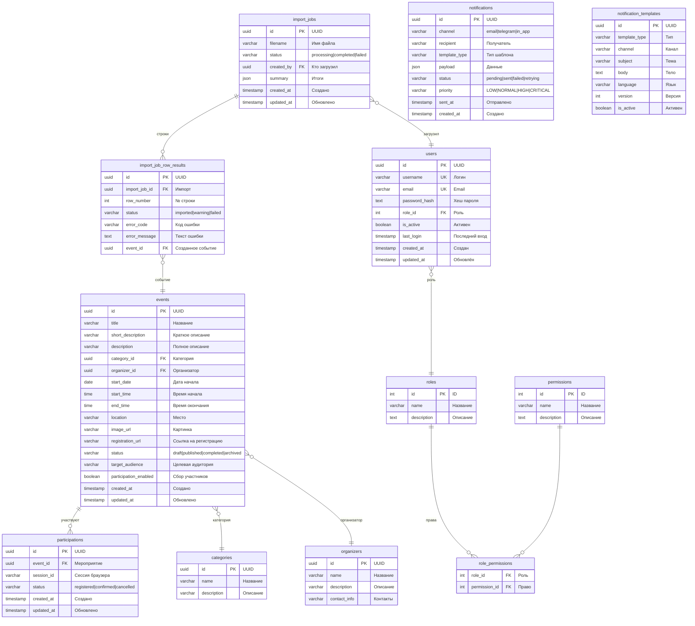

# Схема базы данных «ИС Мероприятия БГИТУ»

> Чтобы получить PNG-файл для отчёта, скопируй блок `mermaid` и вставь на [mermaid.live](https://mermaid.live) → Export → PNG.



## Таблицы и связи — описание

### Основные сущности

| Таблица | Назначение | Записей |
|---|---|---|
| `events` | Мероприятия: лекции, хакатоны, конкурсы и т.д. | основная |
| `categories` | Категории: Лекция, Хакатон, Спорт, Конкурс, Карьера, Культура, Другая | 7+ |
| `organizers` | Организаторы мероприятий (кафедры, деканаты) | ~ |
| `participations` | Записи участников (анонимно, по session_id) | ~ |
| `users` | Пользователи админ-панели (админы, редакторы) | ~ |

### Ролевая модель (RBAC)

| Таблица | Назначение |
|---|---|
| `roles` | Роли: `administrator`, `editor` |
| `permissions` | Права: `event:manage`, `import:create`, ... (12 прав) |
| `role_permissions` | Связь M2M: роль ↔ право |

### Импорт

| Таблица | Назначение |
|---|---|
| `import_jobs` | Загруженные Excel-файлы: статус, итоги |
| `import_job_row_results` | Результат обработки каждой строки: успех/ошибка |

### Уведомления

| Таблица | Назначение |
|---|---|
| `notifications` | Отправленные уведомления: email, telegram |
| `notification_templates` | Шаблоны уведомлений (версионируются) |

---

## Связи (диаграмма)

```
┌──────────────┐       ┌──────────────┐       ┌──────────────┐
│  categories  │       │  organizers  │       │    users     │
│  id (PK)     │       │  id (PK)     │       │  id (PK)     │
│  name        │       │  name        │       │  username    │
└──────┬───────┘       └──────┬───────┘       │  email       │
       │ 1:N                  │ 1:N            │  role_id ────┐
       ▼                      ▼                └──────┬───────┘│
┌──────────────────────────────────────┐              │        │
│              events                  │              ▼        │
│  id (PK)                             │       ┌──────┐       │
│  title, description, location        │       │ roles │◄──────┘
│  start_date, start_time, end_time    │       │ id   │
│  category_id (FK) ────────────► cat  │       │ name │
│  organizer_id (FK) ───────────► org  │       └──┬───┘
│  status, participation_enabled       │          │ M2M
└────────────┬─────────────────────────┘          ▼
             │ 1:N                        ┌──────────────┐   ┌─────────────┐
             ▼                            │role_permission│───│ permissions │
┌─────────────────────┐                   │ role_id (FK) │   │  id (PK)    │
│   participations    │                   │ perm_id (FK) │   │  name       │
│  id (PK)            │                   └──────────────┘   └─────────────┘
│  event_id (FK)      │
│  session_id         │       ┌──────────────────┐
│  status             │       │   import_jobs    │       ┌──────────────────────┐
└─────────────────────┘       │  id (PK)         │──1:N─►│ import_job_row_result│
                              │  filename        │       │  id (PK)             │
                              │  status          │       │  import_job_id (FK)  │
                              │  created_by (FK)─┐       │  row_number          │
                              │  summary         │       │  status, error_code  │
                              └──────────────────┘       │  event_id (FK)       │
                                     │                   └──────────────────────┘
                                     │  N:1
                                     ▼
                              ┌──────────────┐
                              │    users     │
                              └──────────────┘
```
